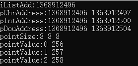
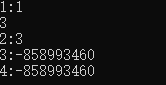
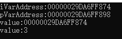
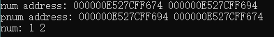

# 指针基础

## 1. 指针的意义

**变量屏蔽了地址，即通过变量读写数据，用户不知道地址的细节**。

指针就是C语言留下的一扇能直接操作数据存储单元的后门。

```c
void iFunc()
{
    int iList[100] = { 256,0,0,0 };
    printf("iListAdd:%d\n", iList); // iList地址
    char* pChr = iList; // C98不允许
    printf("pChrAddress:%d %d\n", pChr, pChr + 1);  // 偏移之后加一个字节
    int* pInt = iList;
    printf("pIntAddress:%d %d\n", pInt, pInt + 1);  // 偏移之后加4个字节
    double* pDou = iList; //C98违法，不能通过
    printf("pDouAddress:%d %d\n", pDou, pDou + 1);  // 偏移之后加8个字节

    // 计算机32位，4个字节
    // 计算机64位，8个字节
    printf("pointSize:%d %d %d\n", sizeof(pChr), sizeof(pInt), sizeof(pDou));
    printf("pointValue:%d %d\n", *pChr, *pInt);
    *pChr = 1;
    printf("pointValue:%d %d\n", *pChr, *pInt);
    *pInt = 258;
    printf("pointValue:%d %d\n", *pChr, *pInt);
}
```

运行结果（x64 debug）：



不同类型的指针变量存储空间大小一样，指针类型决定了偏移单元大小。

## 2. 指针指向空间的读写

`*指针变量`的读写：指针变量指向的存储空间数据的读写。

-   **等号左边**：`*地址`就是**往地址中写入等号右边的数据**；
-   **在其他地方**：`*地址`就是**读出地址中的数据**。

```c
void simpPoint1()
{
    int iVar = 0;
    int* p = &iVar;
    // a = a + 1; <=>  ++a;
    printf("1:%d\n", ++(*p));
    // *p = *p + 1;
    //才进行var的自增
    printf("%d\n", (iVar++, 1 + iVar)); //后置运算讲解
    //后置++是基于语句单元的运算执行完后才开始执行 a ++ + b + c ++;
    (*p)++;
    printf("2:%d\n", *p);
    printf("3:%d\n", *++p);  // 右结合 *(++p)
    printf("4:%d\n", *p++);  // 右结合 *(p++)
}
```

运行结果：



### 1.1 **后置++：**

-   后置++是**基于语句单元的运算执行完后才开始执行**

```c
a ++ + b + c ++;
// 等价于下面式子
a + b + c;
a++;
b++;
```

### [1.2 \*](https://www.wolai.com/xsco5U9ofyQpQnhi2EkPG9 "1.2 *")[**和++运算优先级**](https://www.wolai.com/wdn_dev/oiSyiNoAgqDVtVRVuSvYBU#xsco5U9ofyQpQnhi2EkPG9 "和++运算优先级")

### [1.3 ](https://www.wolai.com/nNeupbqcUozJaCqaKLxALd "1.3 ")[**逗号表达式**](https://www.wolai.com/wdn_dev/oiSyiNoAgqDVtVRVuSvYBU#nNeupbqcUozJaCqaKLxALd "逗号表达式")

## 3. 指针的维度性

**读的过程中**，对某维的地址或者变量加星，实际上是对其进行降维。

对变量进行一次`&`操作，**则获得高出一个维度的地址**，所以在定义指针变量时，需要比原来的变量类型多加一个 \*。

```c
void samplePoint()
{
    int iVar = 3;
    int* pVar = &iVar;
    int** ppVar = &pVar;

    printf("iVarAddress:%p\n", &iVar);
    printf("pVarAddress:%p\n", &pVar);
    printf("value:%p\n", *ppVar);  //ppVar是二维,*ppVar为iVar的地址(一维)
    printf("value:%d\n", **ppVar); //*ppVar为iVar的地址,**ppVar为变量(零维)
}
```

运行结果：



## 4. 指针的一些示例

### 4.1 Sample1

```c
// 画指针的指向
void func1(int* p, int* t)
{
    int tmp = *t;
    *t = ++*p;
    *p = tmp;
}
int main()
{
    int num1 = 1;
    int num2 = 2;
    func1(&num1, &num2);
    printf("%d %d\n", num1, num2);  // 2  2
    return 0;
}
```

### 4.2 Sample2

```c
void func2(int* p, int* t)
{
    int* tmp = t;   // 将t中的值（地址）赋值给指针tmp
    t = p;          // 指向了p指针的存储空间
    p = tmp;        // p指向了tmp指向的存储空间
}
// 指针写操作未发生
int main()
{
    int num1 = 1;
    int num2 = 2;
    func2(&num1, &num2);
    // 在执行完fun2后，num1和num2没有发生任何改变
    // 因为没有对num1和num2的存储空间发生任何写操作
    printf("%d %d\n", num1, num2);  // 1 2
    return 0;
}
```

### 4.3 Sample3

指针的指针来修改指针指向的存储空间的数据

```c
// 什么时候是读数据，从哪个存储单元读数据
// 什么时候是写数据，对那个存储单元写数据
void func3(int** p, int** t)
{
    // p --> &pNum1, pNum1 --> &num1
    // t --> &pNum2, pNum2 --> &num2
    int* tmp = *t;  // tmp --> &pNum2, pNum2 --> &num2
    *t = *p;        // t --> &pNum1, pNum1 --> &num1
    *p = tmp;       // p --> &pNum2, pNum2 --> &num2

    // 修改num2的值
    // **p = 3;        // *p --> &num2, // **p = num2;
}
int main()
{
    int num1 = 1;
    int num2 = 2;
    int* pNum1 = &num1;
    int* pNum2 = &num2;
    func3(&pNum1, &pNum2);
    printf("num address: %p %p\n", &num1, &num2);
    printf("pnum address: %p %p\n", pNum1, pNum2);
    printf("num: %d %d\n", num1, num2);
  
    return 0;
}
```

运行结果：


